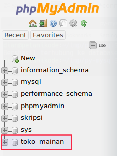
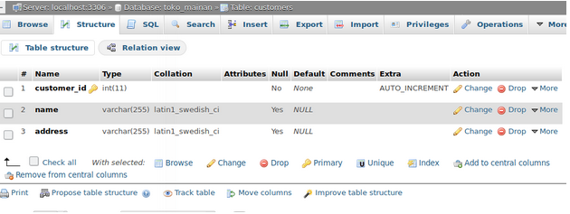

# UTS-PBD-AknisSapriani-195410250
NO 1 
3 DBMS yang bisa digunakan untuk mengelola big data 
 a. RDBMS = IBM DB2, MySQL, Microsoft SQL Server, dan Microsoft Access. 
 b. ORDBMS= Oracle Database , PostgreSQL , dan Microsoft SQL Server . 
 c. OODBMS= Database berorientasi objek Versant , Objectivity / DB , ObjectDB , dan ObjectStore . 
NO 2  
Carilah contoh masalah big data yang bisa dikelola menggunakan salah satu DBMS tersebut, jelaskan mulai dari instalasi sampai CRUD untuk data menggunakan DBMS tersebut. Asumsikan anda akan memecahkan masalah big data yang sudah anda cari contoh tadi, 
jelaskan kira-kira bagaimana arsitektur dari solusi big data menggunakan DBMS tersebut, gambarkan diagramnya.
 
Membuat Halaman CRUD Python dan MySQL dengan menggunakan ubuntu kasus toko mainan
1. Instalasi Modul MySQL Connector
   Ketik peritah berikut untuk menginstal modul mysql untuk Python. 
   $ sudo apt install python3-mysql.connector ATAU pip3 install mysql-connector
2. Koneksi ke MySQL dan membuat connect.py 
import mysql.connector 
db = mysql.connector.connect( 
  host="localhost", 
  user="admin", 
  passwd="admin" 
) 
if db.is_connected() 
  print("Berhasil terhubung ke database") 
3. Jalankan connect.py dengan Python 3. 
   $python3 connect.py 
   Ketika berhasil akan ada keterangan berhasil terhubung Ke Database 
4. Kita membutuhkan modul mysql.connector untuk membuat koneksi ke MySQL. 
   $import mysql.connector 
    Lalu kita membuat koneksi dengan memanggil fungsi connect() dan parameter host, user, dan passwd. 
db = mysql.connector.connect( 
  host="localhost",
  user="admin",
  passwd="admin"
) 
5. Jika menggunakan XAMPP, menggunakan parameter seperti dibawah: 
db = mysql.connector.connect( 
  host="localhost",
  user="root",
  passwd="") 
6. Karena user default di XAMPP adalah root dan di sana biasanya tidak menggunakan password lalu cek koneksi. 
if db.is_connected():
  print("Berhasil terhubung ke database") 
7. Membuat Database
Membuat objek cursor kita tinggal buat seperti dibawah: 
cursor = db.cursor() 
8. Lalu untuk mengeksekusi query, tinggal panggil method execute() dengan parameter string query. 
cursor.execute(sql) 
9. Membuat file baru bernama create_db.py. Kemudian isi dengan kode berikut: 
import mysql.connector 
db = mysql.connector.connect( 
  host="localhost", 
  user="admin", 
  passwd="admin" 
) 
cursor = db.cursor() 
cursor.execute("CREATE DATABASE toko_mainan") 
print("Database berhasil dibuat!") 
 
10. Setelah itu menjalankan create_db.py dengan Python 3. 
python3 create_db.py 
Maka akan ada keterangan database dibuat 
11. Membuat database toko mainan 
db = mysql.connector.connect( 
  host="localhost", 
  user="admin", 
  passwd="admin", 
  database="toko_mainan" 
) 
12. Membuat file baru bernama create_table.py 
import mysql.connector
db = mysql.connector.connect(
  host="localhost",
  user="admin",
  passwd="admin",
  database="toko_mainan"
)
 
cursor = db.cursor()
sql = """CREATE TABLE customers (
  customer_id INT AUTO_INCREMENT PRIMARY KEY,
  name VARCHAR(255),
  address Varchar(255)
)
"""
cursor.execute(sql)
print("Tabel customers berhasil dibuat!")
 
13. Akan ada keterangan tabel customor telah dibuat
python3 create_table.py
 
14. Membuat file baru bernama insert_one.py kemudian isi dengan kode berikut: 
import mysql.connector
db = mysql.connector.connect(
  host="localhost",
  user="admin",
  passwd="admin",
  database="toko_mainan"
)
 
cursor = db.cursor()
sql = "INSERT INTO customers (name, address) VALUES (%s, %s)"
val = ("Dian", "Mataram")
cursor.execute(sql, val)
 
db.commit()
 
print("{} data ditambahkan".format(cursor.rowcount)) 
15. Kode untuk insert data  
sql = "INSERT INTO customers (name, address) VALUES (%s, %s)"
val = ("Dian", "Mataram")
cursor.execute(sql, val) 
db.commit() 
16. Menampilkan data dengan membuat file baru bernama select.py kemudia isi dengan kode berikut: 
import mysql.connector
db = mysql.connector.connect(
  host="localhost",
  user="admin",
  passwd="admin",
  database="toko_mainan"
) 

cursor = db.cursor()
sql = "SELECT * FROM customers"
cursor.execute(sql)
 
results = cursor.fetchall()
 
for data in results:
  print(data) 
17. Update Data dengan membuat file baru bernama update.py. Kemudian isi dengan kode berikut:
import mysql.connector 
db = mysql.connector.connect(
  host="localhost",
  user="admin",
  passwd="admin",
  database="toko_mainan"
) 
cursor = db.cursor()
sql = "UPDATE customers SET name=%s, address=%s WHERE customer_id=%s"
val = ("Ardianta", "Lombok", 1)
cursor.execute(sql, val)
 
db.commit()
 
print("{} data diubah".format(cursor.rowcount)) 
18. Menghapus Data dengan membuat file baru bernama delete.py, kemudian isi dengan kode berikut: 
import mysql.connector
db = mysql.connector.connect(
  host="localhost",
  user="admin",
  passwd="admin",
  database="toko_mainan"
)
 
cursor = db.cursor()
sql = "DELETE FROM customers WHERE customer_id=%s"
val = (1, )
cursor.execute(sql, val)
 
db.commit()
 
print("{} data dihapus".format(cursor.rowcount)) 
19 . Aplikasi CRUDS berbasis CLI dengan membuat file baru bernama app_cruds.py, kemudian isi dengan kode berikut: 
import mysql.connector
import os
 
db = mysql.connector.connect(
  host="localhost",
  user="admin",
  passwd="admin",
  database="toko_mainan"
) 
def insert_data(db):
  name = input("Masukan nama: ")
  address = input("Masukan alamat: ")
  val = (name, address)
  cursor = db.cursor()
  sql = "INSERT INTO customers (name, address) VALUES (%s, %s)"
  cursor.execute(sql, val)
  db.commit()
  print("{} data berhasil disimpan".format(cursor.rowcount)) 
def show_data(db):
  cursor = db.cursor()
  sql = "SELECT * FROM customers"
  cursor.execute(sql)
  results = cursor.fetchall() 
  if cursor.rowcount < 0:
    print("Tidak ada data") 
  else:
    for data in results:
      print(data) 
def update_data(db): 
  cursor = db.cursor()
  show_data(db)
  customer_id = input("pilih id customer> ")
  name = input("Nama baru: ")
  address = input("Alamat baru: ")
  sql = "UPDATE customers SET name=%s, address=%s WHERE customer_id=%s"
  val = (name, address, customer_id)
  cursor.execute(sql, val) 
  db.commit() 
  print("{} data berhasil diubah".format(cursor.rowcount)) 
def delete_data(db):
  cursor = db.cursor()
  show_data(db)
  customer_id = input("pilih id customer> ")
  sql = "DELETE FROM customers WHERE customer_id=%s"
  val = (customer_id,)
  cursor.execute(sql, val)
  db.commit()
  print("{} data berhasil dihapus".format(cursor.rowcount)) 
def search_data(db):
  cursor = db.cursor()
  keyword = input("Kata kunci: ")
  sql = "SELECT * FROM customers WHERE name LIKE %s OR address LIKE %s"
  val = ("%{}%".format(keyword), "%{}%".format(keyword))
  cursor.execute(sql, val)
  results = cursor.fetchall() 
  if cursor.rowcount < 0:
    print("Tidak ada data") 
  else:
    for data in results:
      print(data) 
def show_menu(db): 
  print("=== APLIKASI DATABASE PYTHON ===") 
  print("1. Insert Data") 
  print("2. Tampilkan Data") 
  print("3. Update Data") 
  print("4. Hapus Data") 
  print("5. Cari Data") 
  print("0. Keluar") 
  print("------------------") 
  menu = input("Pilih menu> ")
  #clear screen
  os.system("clear")
 
  if menu == "1":
    insert_data(db)
  elif menu == "2":
    show_data(db)
  elif menu == "3":
    update_data(db)
  elif menu == "4":
    delete_data(db)
  elif menu == "5":
    search_data(db)
  elif menu == "0":
    exit()
  else:
    print("Menu salah!")
if __name__ == "__main__":
 
  while(True):
    show_menu(db)
